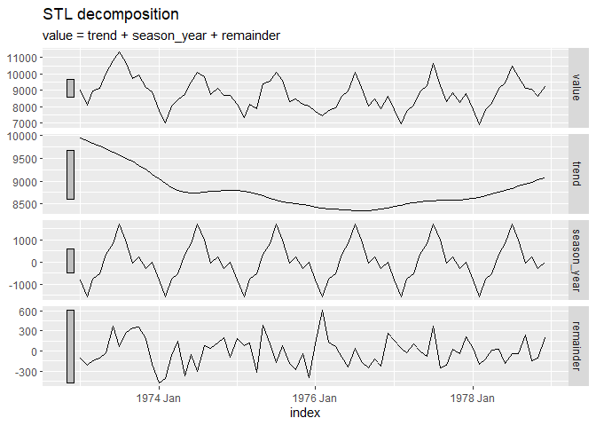

<!-- README.md is generated from README.Rmd. Please edit that file -->

# isaiahr

<!-- badges: start -->

[](https://lifecycle.r-lib.org/articles/stages.html#experimental)
[](https://CRAN.R-project.org/package=isaiahr)
<!-- badges: end -->

The goal of `isaiahr` is to wrap core demonstration functionality
extracted from [Forecasting: Principles and Practice, version
3](https://otexts.com/fpp3/), by Rob J. Hyndman and George
Athanasopoulos of Monash University, Australia.

The name of the package derives from Chapter 1 of Forecasting:
Principles and Practice. It quotes Isaiah chapter 41, verse 23, “[Shewe
the things that are to come hereafter, that wee may knowe that ye are
gods](https://www.kingjamesbibleonline.org/1611_Isaiah-Chapter-41/#23).”
(King James version, 1611)

## Installation

You can install the development version of `isaiahr` like so:

``` r
devtools::install_github("data-science-r/isaiahr")
```

## Example

This is a basic example:

``` r
library(isaiahr)
#> 
#> Attaching package: 'isaiahr'
#> The following object is masked from 'package:stats':
#> 
#>     stl

tsibble::as_tsibble(USAccDeaths) %>%
  stl_components("value") %>%
  fabletools::autoplot()
```



## Futures, Progress

The Monash forecasting tool-kit makes parallel processing with futures
easier. The `fabletools` package makes use of futures automatically if
it finds the `future` package attached during model estimation.

## Rserve

Work in progress.
